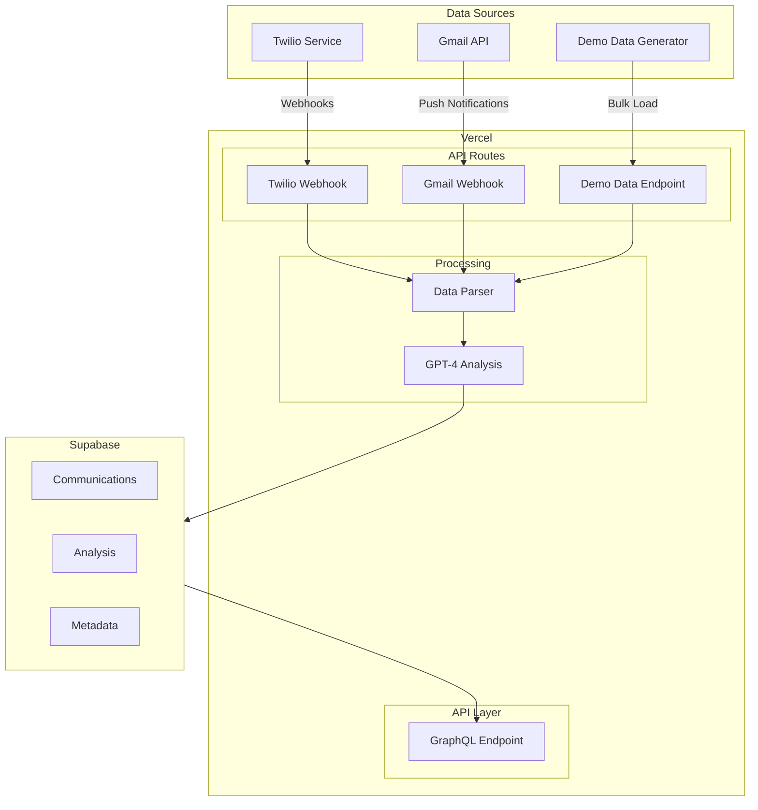

# Communication Analytics Platform 🚀

> Real-time communication analytics platform powered by AI. Process, analyze, and derive insights from calls, SMS, and emails.

## Features 🌟

- 📞 Real-time phone call transcription and analysis
- 📱 SMS message processing and categorization
- 📧 Email integration via Gmail API
- 🤖 AI-powered sentiment analysis and categorization
- 📊 GraphQL API for data access
- 📈 Analytics dashboard
- 🔄 Real-time updates and notifications

## Tech Stack 💻

- **Frontend**: Next.js 14 (App Router)
- **Backend**: Vercel Serverless Functions
- **Database**: Supabase (PostgreSQL)
- **API**: GraphQL with graphql-yoga
- **AI**: GPT-4
- **Communication**: Twilio (Voice + SMS)
- **Email**: Gmail API
- **Authentication**: Supabase Auth
- **Styling**: Tailwind CSS + shadcn/ui

## Architecture 🏗️



## Prerequisites 📋

You'll need accounts and API keys for:

- [Twilio](https://www.twilio.com/) (~$20 initial credit)
- [OpenAI](https://openai.com/) (~$20 initial credit)
- [Google Cloud Console](https://console.cloud.google.com/) (Gmail API)
- [Supabase](https://supabase.com/) (Free tier)
- [Vercel](https://vercel.com/) (Free tier)

## Getting Started 🚀

1. **Clone the repository**
```bash
git clone https://github.com/yourusername/communication-analytics.git
cd communication-analytics
```

2. **Install dependencies**
```bash
npm install
```

3. **Set up environment variables**
```bash
cp .env.example .env.local
```

Required environment variables:
```env
# API Keys
TWILIO_ACCOUNT_SID=xxx
TWILIO_AUTH_TOKEN=xxx
OPENAI_API_KEY=xxx

# Database
SUPABASE_URL=xxx
SUPABASE_ANON_KEY=xxx

# Google API
GOOGLE_CLIENT_ID=xxx
GOOGLE_CLIENT_SECRET=xxx
```

4. **Run development server**
```bash
npm run dev
```

## Project Structure 📁

```
project/
├── app/                  # Next.js app router
│   ├── api/             # API routes
│   ├── dashboard/       # Dashboard pages
│   └── layout.tsx       # Root layout
├── components/          # React components
├── lib/                 # Utility functions
│   ├── ai/             # AI processing
│   ├── db/             # Database operations
│   └── api/            # API utilities
├── types/              # TypeScript types
└── prisma/             # Database schema
```

## Database Schema 🗄️

```typescript
// Key type definitions
type Communication = {
  id: string;              // UUID
  channel: Channel;        // CALL | SMS | EMAIL
  rawContent: string;      // Original content/transcript
  metadata: {
    source: string;        // Phone number/email
    location?: string;     // State code
    duration?: number;     // For calls
    timestamp: Date;
  };
  analysis?: Analysis;     // Linked analysis
  createdAt: Date;
  updatedAt: Date;
};
```

## API Examples 📡

### GraphQL Queries

```graphql
# Fetch communications with analysis
query GetCommunications {
  communications(
    filter: {
      channel: CALL,
      startDate: "2024-01-01"
    }
  ) {
    id
    rawContent
    analysis {
      sentiment
      category
    }
  }
}
```

## Development Timeline ⏱️

### MVP (5 Days)
- **Day 1**: Setup & Infrastructure
- **Day 2**: Demo Data Generation
- **Day 3**: Core Processing
- **Day 4**: API & Query Layer
- **Day 5**: Testing & Dashboard

## Testing 🧪

### Generate Demo Data

```bash
# Generate test data
npm run generate-demo-data

# Run tests
npm test
```

## Deployment 🌐

The application is configured for deployment on Vercel:

1. Push to GitHub
2. Connect repository to Vercel
3. Configure environment variables
4. Deploy!

## Contributing 🤝

1. Fork the repository
2. Create feature branch (`git checkout -b feature/amazing-feature`)
3. Commit changes (`git commit -m 'Add amazing feature'`)
4. Push to branch (`git push origin feature/amazing-feature`)
5. Open Pull Request

## License 📄

This project is licensed under the MIT License - see the [LICENSE](LICENSE) file for details.

## Support 💬

For support, email haloweave@gmail.com or open an issue.

## Roadmap 🛣️

- [x] MVP Features
- [ ] Enhanced Analytics
- [ ] Real-time Dashboard
- [ ] Mobile App
- [ ] Export Features
- [ ] Advanced Search

---

Made with ❤️ by Haloweave
