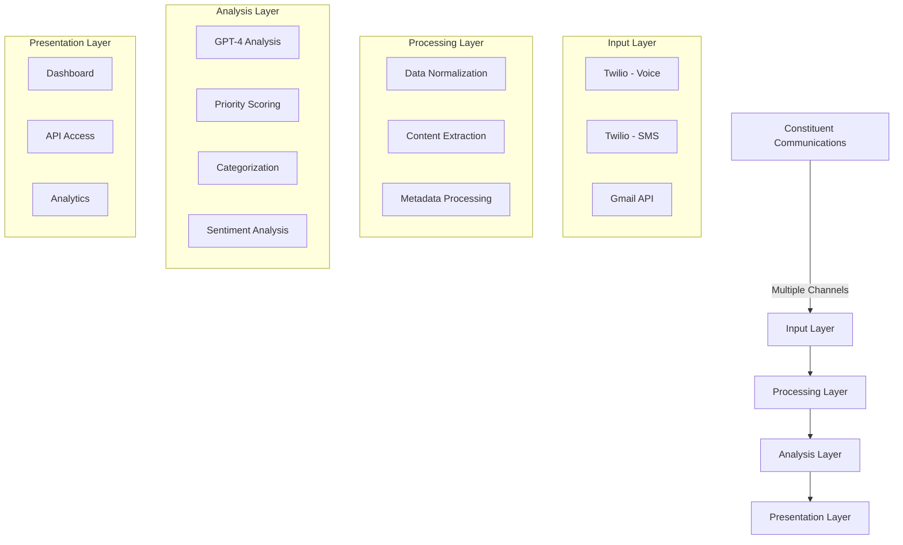
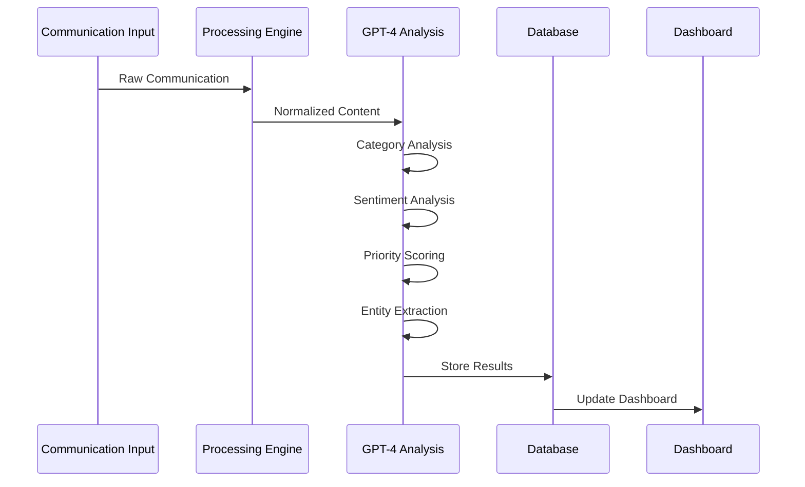

# Get Civic: AI-Powered Constituent Communication Analytics Platform

## Executive Summary

Get Civic is a sophisticated communication analytics platform designed specifically for government authorities to streamline, analyze, and derive actionable insights from constituent communications across multiple channels. By leveraging advanced AI technology and real-time processing, the platform transforms raw constituent feedback into structured, actionable intelligence.

### Core Value Propositions
- **Unified Communication Hub**: Centralize constituent interactions across calls, SMS, and emails
- **AI-Powered Analysis**: Automatic categorization, sentiment analysis, and priority scoring
- **Real-Time Insights**: Instant visibility into constituent concerns and trending issues
- **Data-Driven Decision Making**: Analytics to inform policy and resource allocation
- **Open Data Access**: Secure API for third-party organizations and researchers

## System Architecture

## User Flow & Features

### 1. Administrative Access
- **Secure Authentication**: Clerk-based authentication system
- **Role-Based Access**: Different permission levels for various government departments
- **Custom Domain Integration**: Support for government email domains

### 2. Dashboard Overview
- **Integration Status**: Real-time monitoring of communication channels
- **Key Metrics**:
  - Total Communications Volume
  - General Sentiment Trends
  - Priority Distribution
  - Category Analysis

### 3. Communication Channels

#### Email Integration
- Automated processing of constituent emails
- Attachment handling and thread tracking
- AI-powered response suggestions
- Historical email analysis

#### Voice Integration
- Real-time call transcription
- Automated sentiment analysis
- Priority scoring based on content
- Call recording management

#### SMS Integration
- Automated message processing
- Quick response generation
- Thread tracking
- Priority routing

### 4. AI Analysis Pipeline

#### AI Analysis Components
1. **Sentiment Analysis**
   - Positive/Negative/Neutral classification
   - Confidence scoring
   - Trend analysis

2. **Category Classification**
   - Primary category assignment
   - Secondary category tagging
   - Hierarchical categorization

3. **Priority Scoring**
   - Urgency detection
   - Impact assessment
   - Resource requirement evaluation

4. **Entity Extraction**
   - Location identification
   - Organization recognition
   - Issue categorization

### 5. Insights Dashboard

#### Category Cloud
- Visual representation of issue distribution
- Size indicates volume
- Color indicates priority
- Interactive filtering and drilling

#### Analytics Charts
- **Priority Distribution**: Resource allocation guidance
- **Sentiment Trends**: Public opinion tracking
- **Communication Types**: Channel effectiveness analysis

#### Communications Table
- Comprehensive view of all interactions
- Advanced filtering and search
- Detailed analysis view
- Export capabilities

### 6. API Integration

#### API Features
- **REST API**: Standard CRUD operations
- **Real-time Updates**: WebSocket support
- **Batch Processing**: Bulk data access
- **Filtered Queries**: Custom data selection

#### API Use Cases
1. **Research Organizations**
   - Public opinion analysis
   - Policy impact studies
   - Trend analysis

2. **News Organizations**
   - Real-time issue tracking
   - Public sentiment monitoring
   - Story development

3. **Government Departments**
   - Cross-department coordination
   - Resource allocation
   - Policy planning

## Administrative Tools

### Integration Management
1. **Gmail Configuration**
   - Account connection
   - Email sync controls
   - Filter management
   - Access permissions

2. **Twilio Setup**
   - Phone number management
   - Webhook configuration
   - Call handling rules
   - SMS automation

### Analytics & Reporting
1. **Custom Reports**
   - Data visualization
   - Export options
   - Scheduled reports
   - Custom metrics

2. **Performance Monitoring**
   - Response times
   - Processing status
   - System health
   - Error tracking

## Security & Compliance

### Data Protection
- End-to-end encryption
- Role-based access control
- Audit logging
- Data retention policies

### Compliance
- GDPR compliance
- Data privacy standards
- Security certifications
- Regular audits

## Implementation Benefits

### For Government Officials
1. **Efficient Communication Management**
   - Centralized communication hub
   - Automated processing
   - Priority-based routing
   - Response automation

2. **Data-Driven Decision Making**
   - Real-time insights
   - Trend analysis
   - Resource optimization
   - Impact measurement

3. **Improved Constituent Service**
   - Faster response times
   - Better issue resolution
   - Proactive problem identification
   - Enhanced engagement

### For Constituents
1. **Multiple Communication Channels**
   - Flexible contact options
   - 24/7 accessibility
   - Seamless interaction

2. **Better Service**
   - Faster responses
   - More accurate solutions
   - Improved follow-up
   - Enhanced engagement

## Future Enhancements

### Planned Features
1. **Advanced Analytics**
   - Predictive modeling
   - Machine learning integration
   - Custom AI models
   - Advanced visualizations

2. **Integration Expansion**
   - Additional communication channels
   - Custom integrations
   - API enhancements
   - Mobile applications

3. **Automation Features**
   - Response automation
   - Workflow automation
   - Smart routing
   - Predictive analysis

## Technical Specifications

### System Requirements
- Next.js 14 Application
- PostgreSQL Database
- OpenAI GPT-4 Integration
- Twilio Services
- Gmail API Integration

### Performance Metrics
- Response Time < 200ms
- 99.9% Uptime
- Real-time Updates
- Scalable Architecture

This platform represents a significant advancement in government communication management, providing the tools and insights necessary for effective constituent service and data-driven policy making.