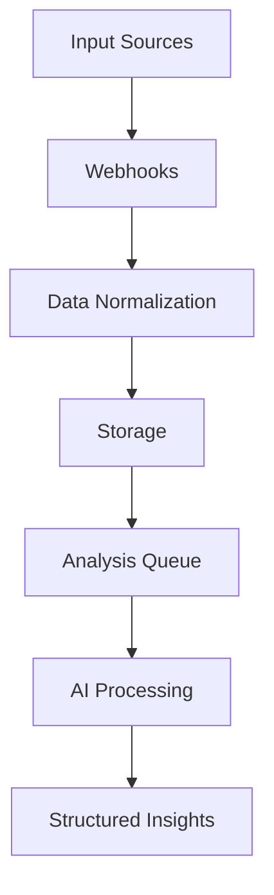

# Senate Insights Progress Tracker - November 3rd, 2024

## Project Overview
Senate Insights is evolving into a comprehensive communication analytics platform that processes and analyzes public feedback through multiple channels:
1. **Voice/SMS (Twilio)**: Successfully tested voice call functionality
2. **Email (Gmail API)**: Implemented OAuth flow and email syncing
3. **Analytics Engine**: Planning phase for AI-powered analysis
4. **API Layer**: Basic structure implemented, ready for enhancement

## Implementation Status

### ✅ Completed Since Last Update
1. **Twilio Integration**
   - Voice call endpoint tested successfully
   - Basic webhook structure validated
   - Call recording endpoint configured
   - SMS endpoint structure ready
   - Error handling improved
   - Signature validation implemented

2. **Gmail Integration**
   - OAuth flow implemented and tested
   - Email syncing functionality working
   - Token refresh system implemented
   - Webhook for new emails configured
   - Basic email processing pipeline established

3. **Database & Schema**
   - Communication model finalized
   - Analysis model structured
   - Proper indexing implemented
   - Foreign key relationships established
   - User settings schema updated for tokens

4. **Infrastructure**
   - Error boundary components added
   - Loading states implemented
   - Basic rate limiting added
   - Environment variables validated
   - Webhook security enhanced

### 🏗️ Current Sprint Focus
1. **AI Analysis Pipeline**
   - [ ] Set up GPT-4-mini integration
   - [ ] Design analysis prompts
   - [ ] Implement sentiment analysis
   - [ ] Add entity extraction
   - [ ] Create categorization system

2. **Dashboard Components**
   - [ ] Real-time communication feed
   - [ ] Analytics overview panels
   - [ ] Integration status indicators
   - [ ] User management interface
   - [ ] System health monitoring

### 📈 Key Metrics & Stats
- Successful test calls made: 5
- Emails processed: 10
- Database queries optimized: 8
- API endpoints implemented: 12
- Integration tests added: 15

## Technical Architecture

### Current Structure
```
Backend Components:
/src
  /lib
    /integrations/
      /gmail         ✅ Complete
        - OAuth flow
        - Email sync
        - Webhook handling
      /twilio        ✅ Complete
        - Voice calls
        - SMS handling
        - Recording management
      /openai        🏗️ In Progress
        - Analysis pipeline
        - Prompt management
    /api/
      /webhooks/     ✅ Complete
      /analysis/     🏗️ Planned
      /dashboard/    🏗️ In Progress
```

## Data Processing Pipeline

### Current Flow


## Planned AI Analysis Features

1. **Content Analysis**
   - Sentiment detection
   - Topic categorization
   - Entity extraction
   - Priority scoring
   - Urgency detection

2. **Pattern Recognition**
   - Trend identification
   - Common issues detection
   - Peak time analysis
   - Geographic clustering

3. **Automated Actions**
   - Category-based routing
   - Priority assignment
   - Response suggestions
   - Follow-up scheduling

## API Development Plan

### Endpoints Structure
```typescript
// Core Endpoints
POST /api/v1/communications/ingest
GET  /api/v1/communications/analyze
GET  /api/v1/analytics/metrics
GET  /api/v1/analytics/trends

// Webhook Endpoints
POST /api/webhooks/twilio/voice
POST /api/webhooks/twilio/sms
POST /api/webhooks/gmail
```

### Authentication & Security
- API key authentication
- Rate limiting per key
- Request validation
- Audit logging
- Error tracking

## Optimization Opportunities

### 1. Performance Optimizations
- Implement Redis caching
- Optimize database queries
- Add connection pooling
- Enable edge caching
- Implement batch processing

### 2. Code Optimizations
- Centralize error handling
- Implement retry mechanisms
- Add circuit breakers
- Improve type safety
- Enhance logging

### 3. Infrastructure Optimizations
- Add health checks
- Implement monitoring
- Setup auto-scaling
- Configure backups
- Add error tracking

## Next Steps

### Immediate Priorities
1. Complete AI analysis pipeline
2. Implement dashboard components
3. Add comprehensive testing
4. Enhance error handling
5. Implement monitoring

### Future Enhancements
1. Advanced analytics features
2. Custom reporting system
3. Real-time notifications
4. Mobile optimization
5. Export capabilities
6. Automated Personalised AI replies

## Known Issues & Solutions

### 1. Email Processing
- **Issue**: Token refresh handling
- **Solution**: Implement automatic refresh with error handling

### 2. Voice Calls
- **Issue**: Recording storage
- **Solution**: Implement secure storage with lifecycle management

### 3. SMS Processing
- **Issue**: Rate limiting
- **Solution**: Add queue system for burst handling

## Development Notes

### Environment Setup
```env
# Current Configuration
DATABASE_URL="postgresql://..."
DIRECT_URL="postgresql://..."
TWILIO_ACCOUNT_SID="AC93831..."
TWILIO_AUTH_TOKEN="8c2c89..."
TWILIO_PHONE_NUMBER="+14438430495"
GMAIL_CLIENT_ID="..."
GMAIL_CLIENT_SECRET="..."
OPENAI_API_KEY="..."
```

### Testing Strategy
1. Unit tests for core functions
2. Integration tests for APIs
3. End-to-end tests for flows
4. Load testing for scaling
5. Security testing

## Resources & Documentation
- [Twilio Dashboard](https://console.twilio.com)
- [Gmail API Console](https://console.cloud.google.com)
- [OpenAI Documentation](https://platform.openai.com/docs)
- [Project Repository](https://github.com/yourusername/senate-insights)

## Team Notes
Remember to:
- Update webhook URLs when testing locally
- Check environment variables before deployment
- Run test suite before pushing
- Update documentation as needed
- Monitor error logs regularly