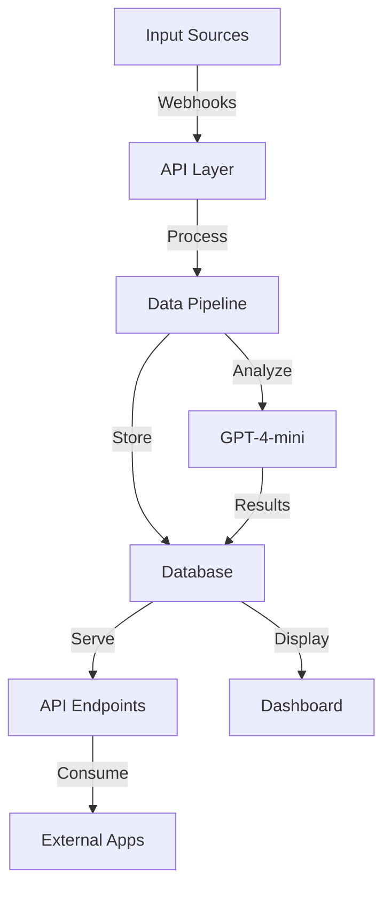

# Get Civic Progress Tracker - November 4th, 2024

## Today's Major Achievements 🎯

### 1. API Implementation ✨
- ✅ Created RESTful API endpoint for communications
- ✅ Implemented secure API key authentication
- ✅ Added API key generation and management
- ✅ Built interactive API testing dashboard
- ✅ Implemented data sanitization for privacy
- ✅ Created comprehensive API documentation UI

### 2. AI Analysis Pipeline
- ✅ Implemented GPT-4-mini integration for email analysis
- ✅ Created structured analysis output:
  - Sentiment analysis with scores
  - Category classification (primary/secondary)
  - Priority scoring (1-5)
  - Content summarization
- ✅ Successfully analyzed and stored results
- ✅ Added error handling for AI processing

### 3. Dashboard Enhancements
- ✅ Built insights dashboard with visualizations
- ✅ Implemented communications filtering
- ✅ Added real-time sync capabilities
- ✅ Created integration status indicators
- ✅ Added API management interface

### 4. Data Schema Improvements
- ✅ Enhanced Analysis model for AI outputs
- ✅ Added API key and usage tracking to User model
- ✅ Optimized metadata handling
- ✅ Improved data relationships

## Current System Architecture



## API Endpoints

```typescript
// Public API Endpoints
GET /api/v1/communications
  - Fetch analyzed communications
  - Supports pagination
  - Returns sanitized data

// Internal Endpoints
POST /api/auth/api-key     // Generate API key
GET  /api/communications   // Dashboard data
POST /api/integrations/*   // Integration webhooks
```

## Remaining TODO List 📝

### 1. Twilio Integration (Priority: High)
```bash
# Location: src/lib/integrations/twilio/
- [ ] Complete voice call testing
- [ ] Implement call recording storage
- [ ] Test SMS functionality
- [ ] Add transcription service
```

### 2. Performance Optimizations (Priority: Medium)
```bash
# Throughout application
- [ ] Add Redis caching
- [ ] Implement rate limiting
- [ ] Optimize database queries
- [ ] Add connection pooling
```

### 3. Testing Framework (Priority: High)
```bash
# Create test suite
- [ ] Set up Jest configuration
- [ ] Add API endpoint tests
- [ ] Create integration tests
- [ ] Add E2E testing
```

### 4. Documentation (Priority: Medium)
```bash
# Project documentation
- [ ] Create API documentation site
- [ ] Add integration guides
- [ ] Create usage examples
- [ ] Document best practices
```

## Future Enhancements 🚀

### 1. Advanced Features
- [ ] Bulk communication processing
- [ ] Advanced search capabilities
- [ ] Custom dashboard layouts
- [ ] Export functionality
- [ ] Thread visualization

### 2. API Enhancements
- [ ] GraphQL API option
- [ ] Webhook notifications
- [ ] Batch processing endpoint
- [ ] Analytics endpoints

### 3. Integration Expansions
- [ ] Additional email providers
- [ ] Social media integrations
- [ ] Custom channel support

## Development Notes 📝

### Environment Setup
Currently required environment variables:
```env
# Core
DATABASE_URL="postgresql://..."
DIRECT_URL="postgresql://..."
OPENAI_API_KEY="sk-..."

# Integrations
GMAIL_CLIENT_ID="..."
GMAIL_CLIENT_SECRET="..."
TWILIO_ACCOUNT_SID="..."
TWILIO_AUTH_TOKEN="..."
TWILIO_PHONE_NUMBER="..."

# Authentication
NEXT_PUBLIC_CLERK_PUBLISHABLE_KEY="..."
CLERK_SECRET_KEY="..."
```

### API Usage Example
```bash
# Fetch communications with API key
curl "https://get-civic.vercel.app/api/v1/communications?limit=5" \
  -H "Authorization: Bearer YOUR_API_KEY"
```

### Quick Start for Development
```bash
git clone https://github.com/yourusername/get-civic.git
cd get-civic
npm install
npm run dev
```

## Next Steps

1. **Short Term**
   - Complete Twilio integration testing
   - Add rate limiting to API
   - Implement caching layer

2. **Medium Term**
   - Set up testing framework
   - Create detailed documentation
   - Add performance monitoring

3. **Long Term**
   - Scale database layer
   - Add advanced analytics
   - Implement machine learning features

## Conclusion

Today marked a significant milestone with the successful implementation of our public API and enhanced AI analysis pipeline. The system now provides a solid foundation for external integrations while maintaining data privacy and security.

Next focus areas:
1. Complete Twilio integration
2. Add comprehensive testing
3. Optimize performance
4. Enhance documentation

Remember to:
- Test API endpoints thoroughly
- Monitor API usage
- Keep security best practices in mind
- Document all new features

## Resources
- [Vercel Dashboard](https://vercel.com)
- [Project Repository](https://github.com/yourusername/get-civic)
- [API Documentation](https://get-civic.vercel.app/dashboard/api)