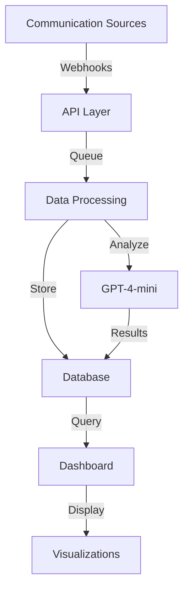

# Senate Insights Progress Tracker - November 4th, 2024

## Today's Major Achievements 🎯

### 1. AI Analysis Pipeline Implementation
- ✅ Implemented GPT-4-mini integration for email analysis
- ✅ Created structured analysis output with sentiment, categories, and priority
- ✅ Designed robust error handling for AI processing
- ✅ Successfully analyzed and stored results in the Analysis model

### 2. Dashboard Enhancements
- ✅ Built Insights dashboard with visualizations
- ✅ Implemented communications table with filtering
- ✅ Added real-time sync capabilities
- ✅ Created status indicators for integrations

### 3. Data Schema Optimization
- ✅ Enhanced Analysis model for structured AI outputs
- ✅ Improved metadata handling for different communication types
- ✅ Implemented proper relationship between Communications and Analysis

## Current System Architecture



## Immediate TODO List 📝

### 1. Enhanced AI Analysis Pipeline (Priority: High)
```bash
# Location: src/lib/services/ai-analysis.ts
- [ ] Add batch processing capability
- [ ] Implement retry mechanism for failed analyses
- [ ] Add analysis caching for improved performance
- [ ] Create detailed logging for AI process monitoring
```

### 2. API Enhancements (Priority: High)
```bash
# Location: src/app/api/v1/
- [ ] Create RESTful API endpoints for external access
- [ ] Implement API key authentication
- [ ] Add rate limiting
- [ ] Create API documentation
```

Implementation Steps:
1. Create new API route structure:
```typescript
/src/app/api/v1/
  ├── auth/
  │   └── route.ts          // API key validation
  ├── communications/
  │   ├── route.ts          // GET, POST endpoints
  │   └── [id]/
  │       └── route.ts      // Single communication operations
  └── analytics/
      └── route.ts          // Analytics endpoints
```

2. Create middleware for API authentication:
```typescript
// src/middleware/api-auth.ts
// Add API key validation logic
```

### 3. Dashboard Improvements (Priority: Medium)
```bash
# Location: src/components/dashboard/
- [ ] Add date range filtering for communications
- [ ] Create advanced search functionality
- [ ] Implement export capabilities
- [ ] Add communication thread visualization
```

Implementation Steps:
1. Update the communication components:
```typescript
src/components/dashboard/communications/
  ├── filters/
  │   ├── date-range.tsx
  │   └── search.tsx
  ├── export/
  │   └── export-data.tsx
  └── visualizations/
      └── thread-view.tsx
```

### 4. Twilio Integration Enhancement (Priority: Medium)
```bash
# Location: src/lib/integrations/twilio/
- [ ] Complete call recording storage system
- [ ] Implement SMS threading
- [ ] Add voice transcription quality improvements
```

### 5. Testing Framework (Priority: High)
```bash
# Create test structure
- [ ] Set up Jest configuration
- [ ] Create API endpoint tests
- [ ] Add integration tests
- [ ] Implement E2E tests with Playwright
```

Implementation Steps:
1. Initialize test environment:
```bash
npm install jest @types/jest ts-jest playwright --save-dev
```

2. Create test structure:
```typescript
src/__tests__/
  ├── api/
  │   └── communications.test.ts
  ├── integrations/
  │   ├── gmail.test.ts
  │   └── twilio.test.ts
  └── e2e/
      └── dashboard.spec.ts
```

### 6. Performance Optimizations (Priority: Medium)
```bash
# Throughout the application
- [ ] Implement Redis caching for frequent queries
- [ ] Add connection pooling for database
- [ ] Optimize API response sizes
```

## Future Enhancements 🚀

### 1. Advanced Analytics
- Implement trend analysis across communications
- Add predictive analytics for response times
- Create custom reporting system

### 2. User Experience
- Add bulk actions for communications
- Implement advanced filtering options
- Create custom dashboard layouts

### 3. Integration Expansions
- Add support for more email providers
- Implement WhatsApp integration
- Add support for social media channels

## Notes for Implementation 📝

1. **API Security**
   - Use API tokens with expiration
   - Implement rate limiting per client
   - Add request validation
   - Log all API access

2. **Data Processing**
   - Implement background jobs for analysis
   - Use caching for frequently accessed data
   - Add retry mechanisms for failed operations

3. **Testing**
   - Create mock data generators
   - Set up CI/CD pipeline
   - Add performance benchmarks

## Environment Updates Required 🔧

Add these to your `.env.local`:
```env
REDIS_URL=
API_SECRET_KEY=
RATE_LIMIT_REQUESTS=100
RATE_LIMIT_WINDOW=900
```

## Next Development Sprint Goals 🎯

1. **Week 1**: API & Authentication
   - Complete API endpoints
   - Implement authentication
   - Add rate limiting

2. **Week 2**: Testing & Documentation
   - Set up testing framework
   - Create API documentation
   - Add integration tests

3. **Week 3**: UI/UX Improvements
   - Enhance dashboard features
   - Add advanced filtering
   - Implement export functionality

## Conclusion

The project has made significant progress with the implementation of AI analysis and dashboard visualization. The next phase focuses on hardening the system, improving performance, and adding production-ready features.

Remember to run tests before pushing changes:
```bash
npm run test        # Unit tests
npm run test:e2e    # E2E tests
npm run build       # Verify build
```

Stay focused on one component at a time and maintain the current high-quality standard of implementation.