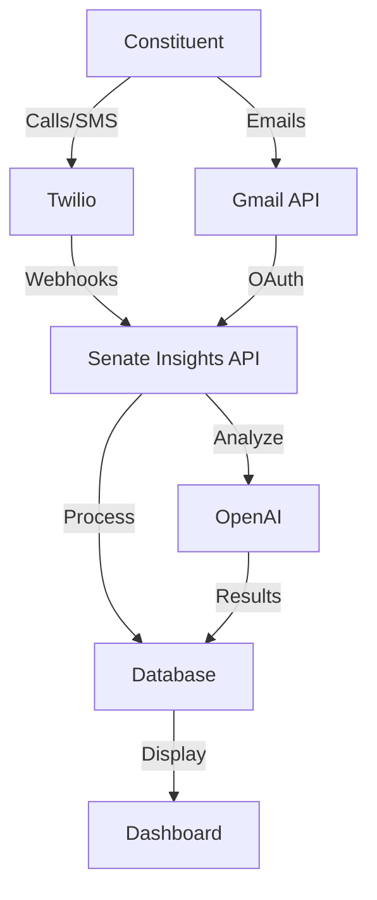
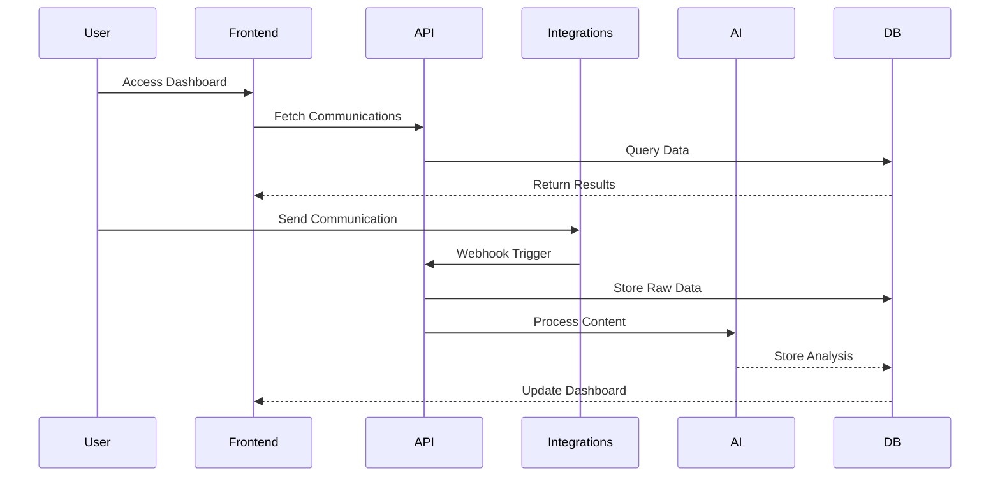
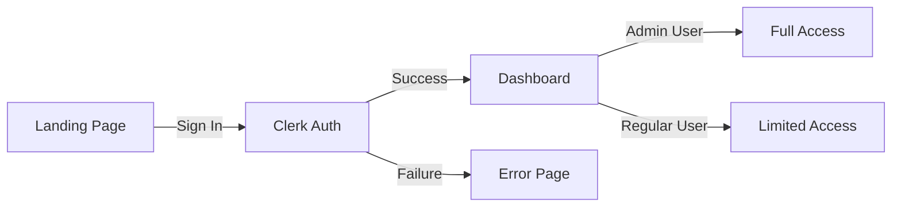
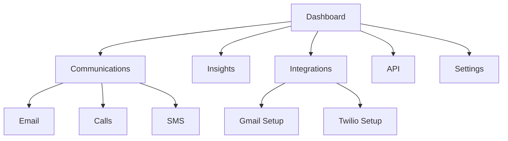
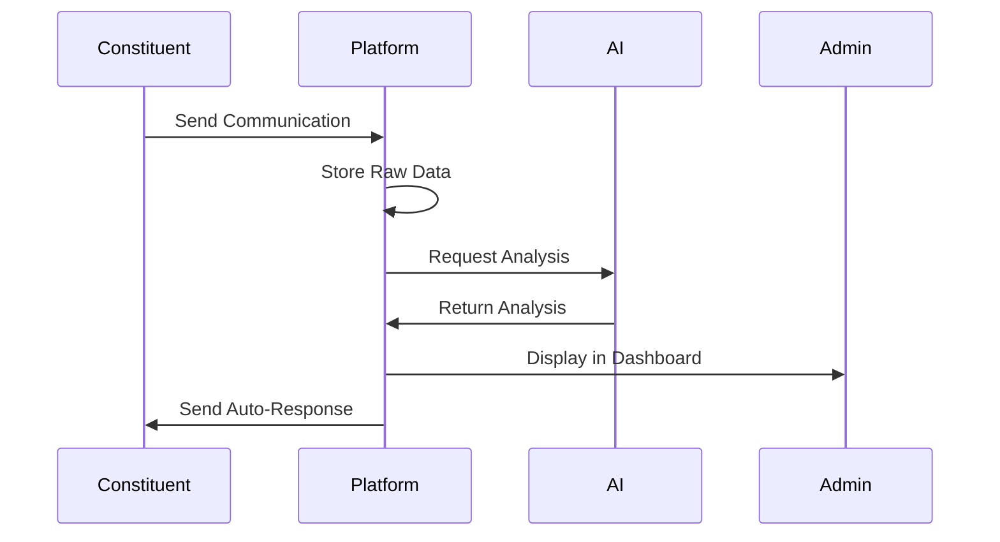

# Senate Insights Platform Documentation

## Table of Contents
- [System Overview](#system-overview)
- [Architecture](#architecture)
- [User Flows](#user-flows)
- [Integration Setup](#integration-setup)
- [API Reference](#api-reference)
- [Development Guide](#development-guide)

## System Overview

Senate Insights is a communication analytics platform that processes and analyzes constituent feedback through multiple channels:
- 📞 Voice Calls (Twilio)
- 📱 SMS Messages (Twilio)
- 📧 Email Communications (Gmail)



## Architecture

### Directory Structure
```
senate-insights/
├── src/
│   ├── app/
│   │   ├── (auth)/
│   │   │   └── dashboard/         # Dashboard routes
│   │   ├── api/
│   │   │   ├── webhooks/         # Integration webhooks
│   │   │   └── v1/              # Public API
│   │   └── page.tsx             # Landing page
│   ├── components/
│   │   ├── dashboard/           # Dashboard components
│   │   └── ui/                  # UI components
│   └── lib/
│       ├── integrations/        # Integration logic
│       └── services/            # Business logic
└── prisma/
    └── schema.prisma            # Database schema
```

### Data Flow


## User Flows

### 1. Authentication Flow


### 2. Dashboard Navigation


### 3. Communication Processing Flow


## Integration Setup

### 1. Gmail Integration
1. Configure OAuth Credentials
   ```typescript
   // src/lib/integrations/gmail/client.ts
   export const gmailClient = new GmailClient({
     clientId: process.env.GMAIL_CLIENT_ID,
     clientSecret: process.env.GMAIL_CLIENT_SECRET
   });
   ```

2. Setup Webhooks
   ```typescript
   // Webhook URL: /api/webhooks/gmail
   const webhookUrl = `${process.env.NEXT_PUBLIC_URL}/api/webhooks/gmail`;
   ```

### 2. Twilio Integration
1. Voice Configuration
   ```typescript
   // Voice Webhook: /api/webhooks/twilio/voice
   twiml.record({
     transcribe: true,
     transcribeCallback: `${baseUrl}/transcription`,
     recordingStatusCallback: `${baseUrl}/recording-status`
   });
   ```

2. SMS Configuration
   ```typescript
   // SMS Webhook: /api/webhooks/twilio/sms
   const twiml = new MessagingResponse();
   twiml.message('Processing your message...');
   ```

## API Reference

### Public API Endpoints
```typescript
// Base URL: https://senate-insights.vercel.app/api/v1

// Communications
GET  /communications
POST /communications/analyze

// Authentication
POST /auth/api-key
```

### Webhook Endpoints
```typescript
// Twilio Webhooks
POST /webhooks/twilio/voice
POST /webhooks/twilio/voice/recording-status
POST /webhooks/twilio/voice/transcription
POST /webhooks/twilio/sms

// Gmail Webhooks
POST /webhooks/gmail
```

## Development Guide

### Environment Setup
```bash
# Clone repository
git clone https://github.com/yourusername/senate-insights.git

# Install dependencies
npm install

# Set up environment variables
cp .env.example .env.local

# Start development server
npm run dev
```

### Required Environment Variables
```env
# Core
DATABASE_URL="postgresql://..."
OPENAI_API_KEY="sk-..."

# Twilio
TWILIO_ACCOUNT_SID="AC..."
TWILIO_AUTH_TOKEN="..."
TWILIO_PHONE_NUMBER="+1..."

# Gmail
GMAIL_CLIENT_ID="..."
GMAIL_CLIENT_SECRET="..."

# Auth
NEXT_PUBLIC_CLERK_PUBLISHABLE_KEY="..."
CLERK_SECRET_KEY="..."
```

### Testing Integrations
1. Start local server with ngrok
   ```bash
   ngrok http 3000
   ```

2. Update webhook URLs in Twilio Console
   ```
   Voice: https://<your-ngrok-url>/api/webhooks/twilio/voice
   SMS: https://<your-ngrok-url>/api/webhooks/twilio/sms
   ```

3. Test each channel:
   - Make test call to Twilio number
   - Send test SMS
   - Send test email to haloweaveinsights@gmail.com

### Deployment
```bash
# Deploy to Vercel
vercel deploy

# Update webhook URLs to production
https://senate-insights.vercel.app/api/webhooks/...
```